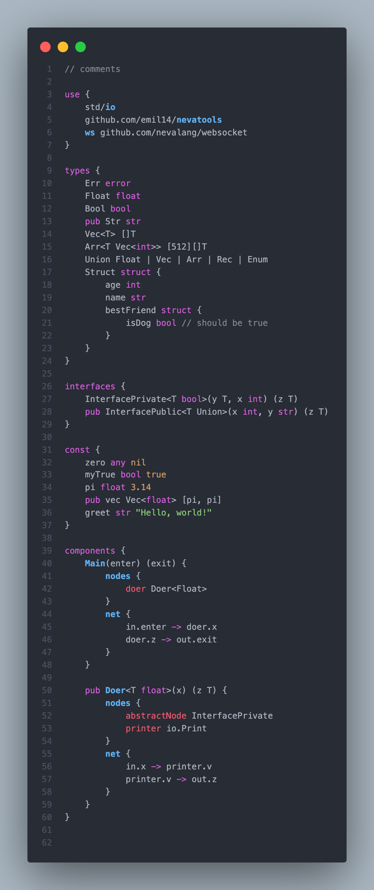

# Neva Programming Language

This is a VScode extension for [Neva](https://github.com/nevalang/neva) - a flow based programming language with static types.

> **Warning**: extension only works if nevalang module is root of your workspace! I.e. `neva.y(a)ml` is at the root of the project, opened in the editor.

## Requirements

- [Neva](https://github.com/nevalang/neva) programming language installed

## Features

### Syntax Highlighting

### Error messages (Diagnostics)

Error messages occur as you type in the _problems_ panel

### Run CodeLens

`▶ Run` appears above `def Main` and runs `neva run` in a VS Code terminal.

### Snippets

Basic snippets are available for core language constructs:

- `import`
- `main`
- `def`
- `pubdef`
- `struct`
- `union`
- `const`

### Visual Editor

`Neva: Open Visual Mode` opens the same read-only React editor as `neva-view`, directly beside the source file. It talks to the already-running language server, so it needs no separate HTTP server or browser process. Saving a `.neva` file refreshes its projection.

## Contributing

See [./Contributing.md](Contributing.md)

### Open VSX

Package: `npm run package:vsix`

Publish (requires `OPEN_VSX_TOKEN`): `npm run publish:openvsx`

### VS Code Marketplace (CI/CD)

The repository includes automated publishing on GitHub Release:

- Workflow: `.github/workflows/release-marketplace.yml`
- Trigger: published GitHub release (or manual `workflow_dispatch`)
- Behavior: downloads and verifies separately locked `neva-lsp` binaries and the shared visual-editor WebView bundle, packages extension, and publishes to Marketplace. `neva-view` is not part of this dependency graph.

Required secret in GitHub repository settings:

- `VSCE_PAT` - token with publish rights for publisher `nevalang`

Release flow:

1. Bump `package.json` version (for example `0.7.8`) and commit.
2. Create git tag `v0.7.8` and GitHub Release from that tag.
3. Workflow validates that tag version matches `package.json`, then publishes automatically.

## Release Notes

### 0.7.10

- Updated the bundled LSP to `lsp/v0.1.2` with diagnostics for unsaved edits.
- Kept completion, navigation, semantic tokens and CodeLens available while an
  unsaved compiler error is displayed.
- Added an Extension Host integration contract covering diagnostics, language
  features, Run and packaged Visual Mode; release packaging is verified in a
  separate CI job.

### 0.7.9

- Updated bundled `neva-lsp` binaries to use Neva workspace indexing that does not require a `Main` package in module root.
- Fixed `▶ Run` CodeLens placement to stay anchored to the `def Main` line.
- Fixed `▶ Run` command to execute in the current file package (`neva run .` from package directory), so module-root workspaces with subdirectory packages run correctly.

### 0.7.8

- Integrated Neva LSP core language feature set from `nevalang/neva-tools`:
  - completion
  - hover
  - go to definition
  - find references
  - rename / prepare rename
  - document symbols / outline
  - code lens + resolve
  - semantic tokens
- Added packaging guard (`npm run check:lsp-binaries`) to ensure all required OS/arch LSP binaries are bundled before `vsce package`.
- Added a release smoke-test checklist: [./docs/lsp-smoke-checklist.md](./docs/lsp-smoke-checklist.md).
- LSP protocol tracing is now configurable with `neva.trace.server` (`off`, `messages`, `verbose`), defaulting to `off` for production.
- Documentation update for the new release process and version bump.

### 0.7.6

- Added missing support for `x64` platform for linux (alias for amd64)
- Updated Neva compiler version that includes critical bug-fixes
- Minor refactor - remove unused webview-related TS code

### 0.7.5

- Added support for other OS/Arch including Windows and Linux arm64/amd64
- Fixed bug when LSP did lookup higher than opened workspace
- Some other minor bug-fixes

### 0.7.4

- Updated LSP to match latest syntax changes

### 0.7.3

  - Syntax highlighting fixes
  - Deferred connections
  - Some more minor fixes due to new syntax

### 0.7.2

- Critical bugfix (LSP wasn't working at all)
  - Added missing bundling step (via esbuild)
  - Removed `lsp` binary from `.vscodeignore`

### 0.7.1

- Updated syntax highlighting to mach latest changes in compiler
  - `map` native type was replaced with `dict` (to avoid confusion with `Map` component)

### 0.7.0

- LSP improvements
  - Sending errors to VSCode "problems" panel
  - Support for TCP in debug-mode (for extension developers)
- Updated syntax highlighting to mach latest changes in compiler
  - `flow` keyword was replaced with `def`
- Internal Changes (minor refactoring)

### 0.6.0

- Updated syntax highlighting to mach latest changes in compiler
  - Replaced `component` keyword with `flow`
  - Removed all _group forms_ for entity declarasions

### 0.5.0

- Updated syntax highlighting after removing "net" keyword
- Fixed syntax highlighting for nodes without ports in component connections

### 0.4.0

- Add support for single-form entity declaration
- Internals: refactor tmlanguage syntax file

### 0.3.0

- Web-view temporary removed after massive rewriting of the language
- Updated syntax highlighting to match **new grammar**
- Updated icons for command menu and files
- Updated header with **new logo**

### 0.2.0

- **LSP**-compatible **Language Server**
- **WebView**-based **Custom editor** for visual editing of `.neva` files

### 0.1.0

- First release with textmate (regexp) based **syntax highlighting**.
