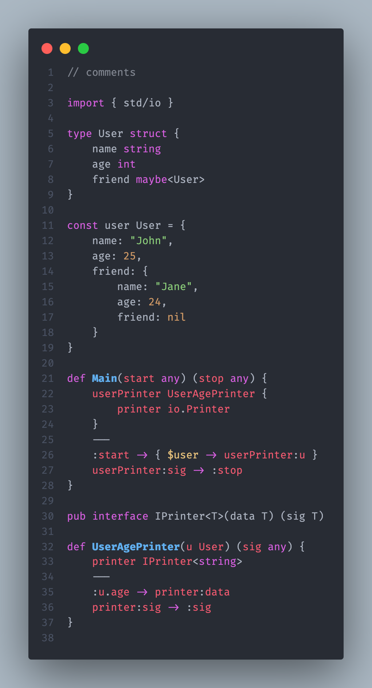

# Neva Programming Language

This is a VScode extension for [Neva](https://github.com/nevalang/neva) - a flow based programming language with static types.

> **Warning**: extension only works if nevalang module is root of your workspace! I.e. `neva.y(a)ml` is at the root of the project, opened in the editor.

## Requirements

- [Neva](https://github.com/nevalang/neva) programming language installed

## Features

### Syntax Highlighting

### Error messages (Diagnostics)

Error messages occur as you type in the _problems_ panel

### Visual Editor (WIP)

Currently disabled due to massive changes in the language. You can see the source code in the `webview` directory.

## Contributing

See [./Contributing.md](Contributing.md)

## Release Notes

### 0.7.2

- Critical bugfix (LSP wasn't working at all)
  - Added missing bundling step (via esbuild)
  - Removed `lsp` binary from `.vscodeignore`

### 0.7.1

- Updated syntax highlighting to mach latest changes in compiler
  - `map` native type was replaced with `dict` (to avoid confusion with `Map` component)

### 0.7.0

- LSP improvements
  - Sending errors to VSCode "problems" panel
  - Support for TCP in debug-mode (for extension developers)
- Updated syntax highlighting to mach latest changes in compiler
  - `flow` keyword was replaced with `def`
- Internal Changes (minor refactoring)

### 0.6.0

- Updated syntax highlighting to mach latest changes in compiler
  - Replaced `component` keyword with `flow`
  - Removed all _group forms_ for entity declarasions

### 0.5.0

- Updated syntax highlighting after removing "net" keyword
- Fixed syntax highlighting for nodes without ports in component connections

### 0.4.0

- Add support for single-form entity declaration
- Internals: refactor tmlanguage syntax file

### 0.3.0

- Web-view temporary removed after massive rewriting of the language
- Updated syntax highlighting to match **new grammar**
- Updated icons for command menu and files
- Updated header with **new logo**

### 0.2.0

- **LSP**-compatible **Language Server**
- **WebView**-based **Custom editor** for visual editing of `.neva` files

### 0.1.0

- First release with textmate (regexp) based **syntax highlighting**.
